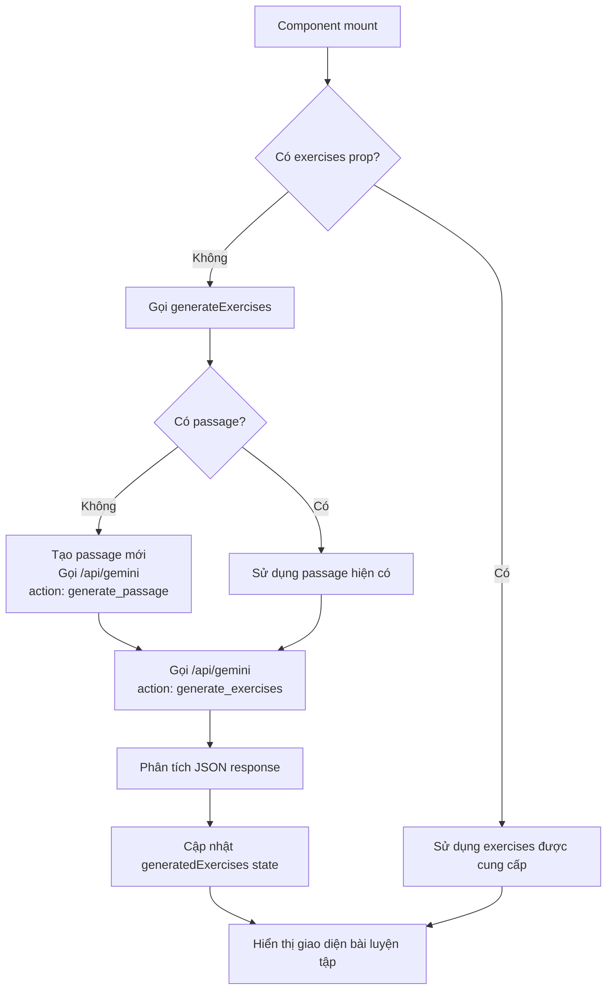
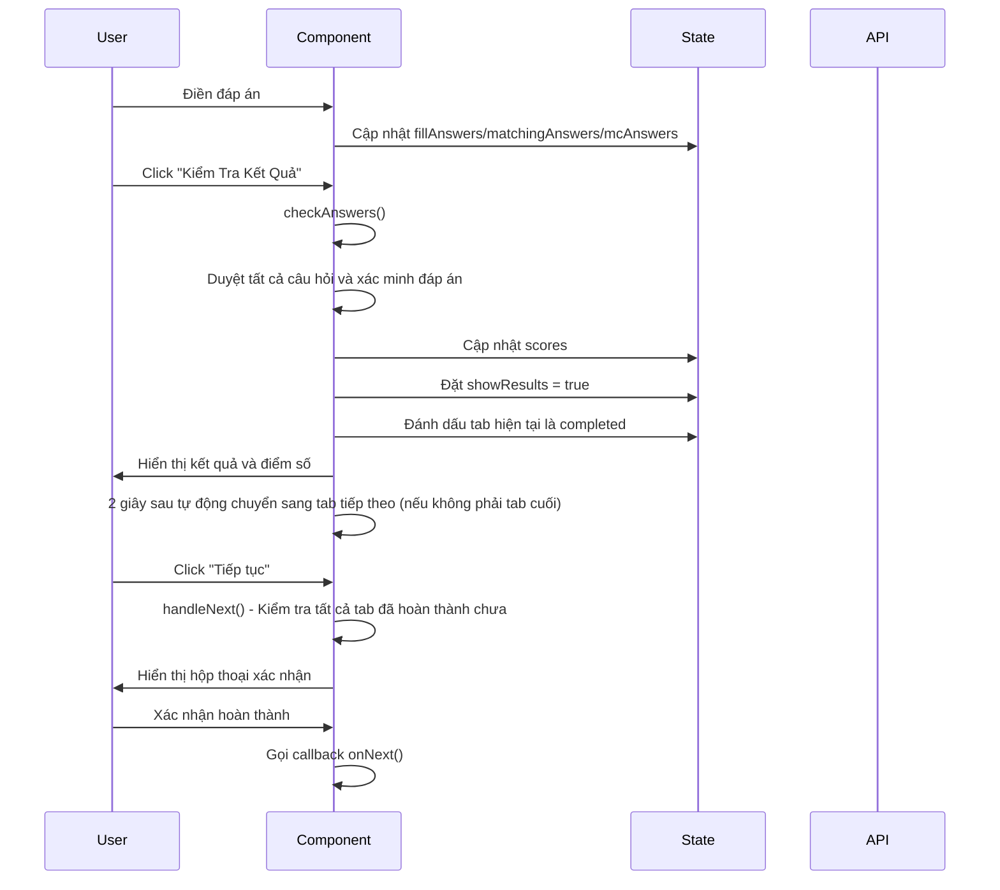
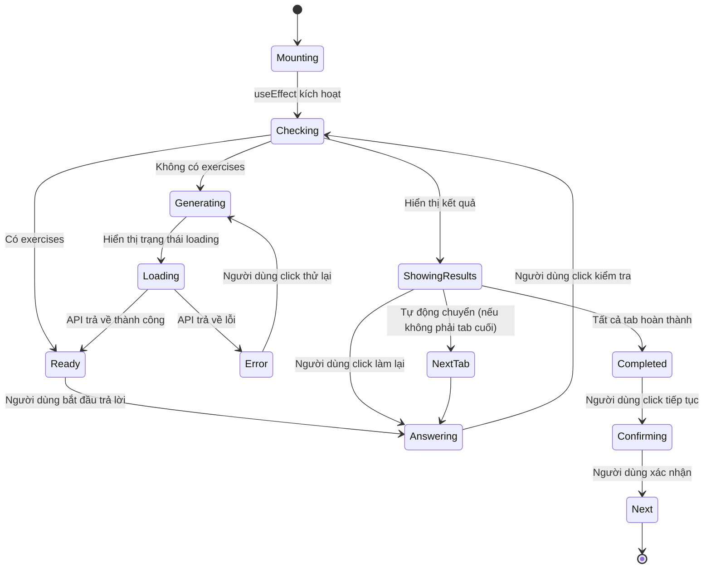
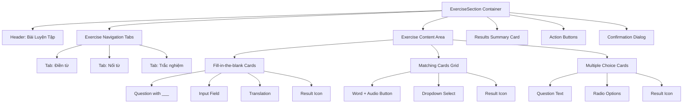

# ExerciseSection Component - Knowledge Documentation

## Tổng quan

`ExerciseSection` là một React client component dùng để hiển thị và đánh giá các bài luyện tập từ vựng do AI tạo ra. Đây là bước thứ 4 trong quy trình học của WordForge AI, sau bài đọc hiểu và luyện viết, trước phần luyện nghe và nói. Component này triển khai ba loại bài tập: điền từ vào chỗ trống, nối từ và trắc nghiệm, hỗ trợ chấm điểm tự động, phản hồi kết quả và theo dõi tiến độ.

### Công nghệ sử dụng
- **Ngôn ngữ**: TypeScript
- **Framework**: Next.js 15 (App Router) - Client Component
- **Thư viện UI**: Radix UI + Tailwind CSS
- **Quản lý trạng thái**: React Hooks (useState, useEffect, useCallback)
- **Thông báo**: Sonner (toast notifications)
- **Icon**: Lucide React

### Chức năng chính
1. **Tạo bài luyện tập bằng AI**: Dựa trên đoạn văn đọc hiểu và danh sách từ vựng, tạo ba loại bài luyện tập thông qua Gemini API
2. **Giao diện tương tác**: Hỗ trợ người dùng nhập đáp án, chọn phương án và xem kết quả
3. **Hệ thống chấm điểm tự động**: Xác minh đáp án và tính điểm theo thời gian thực
4. **Quản lý tiến độ**: Theo dõi các loại bài tập đã hoàn thành, ngăn bỏ qua bài tập chưa làm
5. **Chức năng phát âm**: Sử dụng Web Speech API để phát âm từ vựng (tiếng Anh)

---

## Chi tiết triển khai

### Chữ ký component

```typescript
interface ExerciseSectionProps {
  exercises: ExerciseData | null      // Bài luyện tập được tạo sẵn (tùy chọn)
  vocabulary: Array<{                  // Danh sách từ vựng
    word: string
    type: string
    vietnamese_meaning: string
  }>
  language: string                      // Ngôn ngữ đích
  proficiency: string                  // Trình độ ngôn ngữ (A1, A2, B1, v.v.)
  passage: string                      // Đoạn văn đọc hiểu (dùng để tạo bài luyện tập)
  topic?: string                       // Chủ đề (tùy chọn)
  onNext: () => void                   // Callback khi hoàn thành
}
```

### Cấu trúc dữ liệu

#### Interface ExerciseData
```typescript
interface ExerciseData {
  fill_in_the_blanks: Array<{
    question: string      // Câu hỏi chứa placeholder "___"
    answer: string       // Đáp án đúng
    translation?: string // Bản dịch tiếng Việt (tùy chọn)
    options?: string[]   // Gợi ý tùy chọn
  }>
  matching: Array<{
    word: string         // Từ vựng
    meaning: string      // Ý nghĩa/định nghĩa
    translation?: string // Bản dịch tiếng Việt (tùy chọn)
  }>
  multiple_choice: Array<{
    question: string     // Văn bản câu hỏi
    options: string[]    // Mảng các phương án
    answer: string       // Đáp án đúng
    translation?: string // Bản dịch tiếng Việt (tùy chọn)
  }>
}
```

### Quản lý trạng thái

Component sử dụng nhiều React state để quản lý các dữ liệu khác nhau:

```typescript
const [currentExercise, setCurrentExercise] = useState(0)        // Chỉ mục loại bài tập hiện tại
const [fillAnswers, setFillAnswers] = useState<{ [key: number]: string }>({})      // Đáp án bài điền từ
const [matchingAnswers, setMatchingAnswers] = useState<{ [key: number]: string }>({}) // Đáp án bài nối từ
const [mcAnswers, setMcAnswers] = useState<{ [key: number]: string }>({})          // Đáp án bài trắc nghiệm
const [showResults, setShowResults] = useState(false)             // Có hiển thị kết quả không
const [scores, setScores] = useState({ fill: 0, matching: 0, mc: 0 }) // Điểm số các loại bài tập
const [generatedExercises, setGeneratedExercises] = useState<ExerciseData | null>(exercises || null) // Bài luyện tập đã tạo
const [isGeneratingExercises, setIsGeneratingExercises] = useState(false) // Có đang tạo không
const [showConfirmation, setShowConfirmation] = useState(false)   // Hộp thoại xác nhận
const [completedTabs, setCompletedTabs] = useState<Set<number>>(new Set()) // Các loại bài tập đã hoàn thành
```

### Quy trình logic chính

#### 1. Quy trình tạo bài luyện tập



#### 2. Quy trình trả lời và chấm điểm



#### 3. Logic xác minh đáp án

**Xác minh bài điền từ**:
```typescript
// Không phân biệt chữ hoa/thường, loại bỏ khoảng trắng đầu cuối rồi so sánh
fillAnswers[index]?.toLowerCase().trim() === exercise.answer.toLowerCase().trim()
```

**Xác minh bài nối từ**:
```typescript
// Khớp chính xác (phân biệt chữ hoa/thường)
matchingAnswers[index] === exercise.meaning
```

**Xác minh bài trắc nghiệm**:
```typescript
// Khớp chính xác (phân biệt chữ hoa/thường)
mcAnswers[index] === exercise.answer
```

### Các hàm quan trọng

#### generateExercises()
- **Mục đích**: Tạo bài luyện tập bất đồng bộ
- **Logic**:
  1. Nếu không có passage, gọi API để tạo một đoạn văn trước
  2. Sử dụng passage và vocabulary gọi `/api/gemini` để tạo bài luyện tập
  3. Xử lý lỗi và hiển thị thông báo lỗi thân thiện với người dùng
- **Phụ thuộc**: `passage`, `vocabulary`, `language`, `proficiency`, `topic`

#### checkAnswers()
- **Mục đích**: Xác minh tất cả đáp án và tính điểm
- **Logic**:
  1. Duyệt ba loại bài tập, xác minh từng đáp án
  2. Tính điểm cho từng loại
  3. Cập nhật scores và showResults state
  4. Đánh dấu tab hiện tại là đã hoàn thành
  5. Hiển thị tổng điểm và thông báo
  6. Nếu không phải tab cuối, 2 giây sau tự động chuyển sang tab tiếp theo

#### handleNext()
- **Mục đích**: Xử lý click nút "Tiếp tục"
- **Xác minh**: Kiểm tra tất cả tab đã hoàn thành chưa (`completedTabs.size === exerciseTypes.length`)
- **Logic**: Nếu tất cả đã hoàn thành, hiển thị hộp thoại xác nhận; nếu không, hiển thị cảnh báo

#### speakWord()
- **Mục đích**: Sử dụng Web Speech API để phát âm từ
- **Cấu hình**: 
  - Ngôn ngữ: 'en-US'
  - Tốc độ: 0.8
- **Tương thích trình duyệt**: Kiểm tra `'speechSynthesis' in window`

---

## Dependencies

### Phụ thuộc trực tiếp

#### Gói bên ngoài
1. **react** - Thư viện React cốt lõi
2. **lucide-react** - Thư viện icon (ArrowRight, CheckCircle, XCircle, RotateCcw, Volume2)
3. **sonner** - Thư viện thông báo Toast

#### Component nội bộ
1. `@/components/ui/button` - Component nút (dựa trên Radix UI)
2. `@/components/ui/card` - Component card (Card, CardContent, CardHeader, CardTitle)
3. `@/components/ui/input` - Component input

### Phụ thuộc API

#### `/api/gemini` (POST)
- **Thao tác**: `generate_passage` - Tạo đoạn văn đọc hiểu
- **Thao tác**: `generate_exercises` - Tạo bài luyện tập
- **Request body**:
```typescript
{
  action: "generate_exercises" | "generate_passage",
  passage?: string,
  vocabulary: VocabularyItem[],
  language: string,
  proficiency: string,
  topic?: string
}
```
- **Response**:
```typescript
// Response generate_exercises
{
  exercises: ExerciseData
}

// Response generate_passage
{
  passage: string
}
```

### Phụ thuộc component cha

#### LessonFlow.tsx
- ExerciseSection là component bước 4 trong LessonFlow
- Nhận dữ liệu passage và vocabulary từ các bước trước
- Thông qua callback `onNext()` thông báo LessonFlow chuyển sang bước tiếp theo (luyện nghe và nói)

### Sơ đồ phân cấp phụ thuộc

```mermaid
graph TD
    A[ExerciseSection] --> B[Button Component]
    A --> C[Card Component]
    A --> D[Input Component]
    A --> E[Sonner Toast]
    A --> F[Lucide Icons]
    A --> G[/api/gemini Route]
    G --> H[Google Gemini AI]
    I[LessonFlow] --> A
    J[ReadingPassage] -.dữ liệu passage.-> I
    K[VocabularyList] -.dữ liệu vocabulary.-> I
```

---

## Visual Diagrams

### Vòng đời component



### Luồng dữ liệu

```mermaid
graph LR
    A[LessonFlow] -->|props| B[ExerciseSection]
    B -->|fetch POST| C[/api/gemini]
    C -->|JSON response| B
    B -->|setState| D[generatedExercises]
    D -->|render| E[Exercise UI]
    E -->|user input| F[Answer States]
    F -->|checkAnswers| G[Scores]
    G -->|showResults| H[Results Display]
    H -->|onNext| A
```

### Cấu trúc bố cục UI



---

## Key Patterns & Design Decisions

### 1. Tự động tạo vs tải sẵn
- **Quyết định**: Nếu component cha không cung cấp exercises, component sẽ tự động gọi API để tạo
- **Lý do**: Cung cấp trải nghiệm người dùng tốt hơn, giảm độ phức tạp của component cha
- **Đánh đổi**: Tăng trách nhiệm của component, nhưng tăng khả năng tái sử dụng

### 2. Cơ chế fallback Passage
- **Quyết định**: Nếu không có passage, tạo passage trước rồi mới tạo exercises
- **Lý do**: Đảm bảo exercises có ngữ cảnh
- **Trải nghiệm người dùng**: Hiển thị trạng thái loading và thông tin giải thích

### 3. Tự động chuyển Tab
- **Quyết định**: Sau khi kiểm tra đáp án, nếu không phải tab cuối, 2 giây sau tự động chuyển
- **Lý do**: Hướng dẫn người dùng hoàn thành tất cả bài tập, nhưng vẫn cho thời gian xem kết quả
- **Có thể cấu hình**: Hiện tại hardcode là 2 giây, có thể cân nhắc làm prop

### 4. Cơ chế xác minh hoàn thành
- **Quyết định**: Sử dụng Set `completedTabs` để theo dõi các loại bài tập đã hoàn thành
- **Lý do**: Ngăn người dùng bỏ qua bài tập chưa làm để chuyển sang bước tiếp theo
- **Triển khai**: Mỗi lần kiểm tra đáp án, đánh dấu tab hiện tại là đã hoàn thành

### 5. Chiến lược xác minh đáp án
- **Bài điền từ**: Không phân biệt chữ hoa/thường, trim khoảng trắng (linh hoạt hơn)
- **Bài nối từ/Trắc nghiệm**: Khớp chính xác (nghiêm ngặt hơn)
- **Lý do**: Bài điền từ có thể liên quan đến biến thể đầu vào của người dùng, các loại khác là các phương án đặt trước

### 6. Xử lý lỗi
- **Thân thiện với người dùng**: Tất cả thông báo lỗi sử dụng tiếng Việt
- **Cơ chế thử lại**: Cung cấp nút "Thử lại"
- **Tùy chọn fallback**: Cung cấp tùy chọn tải lại trang
- **Phân biệt trạng thái**: Phân biệt trạng thái "đang tạo" và "lỗi", cung cấp UI khác nhau

### 7. Log debug
- **Lưu ý**: Component chứa nhiều câu lệnh `console.log` để debug
- **Gợi ý**: Trong môi trường production nên xóa hoặc sử dụng biến môi trường để kiểm soát

---

## Error Handling

### Xử lý lỗi API

```typescript
// Tạo passage thất bại
catch (error) {
  console.error("Lỗi khi tạo đoạn văn cho bài luyện tập:", error)
  toast.error("Không thể tạo đoạn văn cho bài luyện tập. Vui lòng quay lại bước trước.")
  return  // Trả về sớm, không tiếp tục tạo exercises
}

// Tạo exercises thất bại
catch (error) {
  console.error("Lỗi khi tạo bài luyện tập:", error)
  toast.error("Có lỗi xảy ra khi tạo bài luyện tập")
}
```

### UI trạng thái lỗi
- **Trạng thái đang tạo**: Hiển thị animation loading và văn bản giải thích
- **Trạng thái lỗi**: Hiển thị thông báo lỗi, nút thử lại và tùy chọn tải lại trang
- **Trạng thái trống**: Khi không có exercises và không đang tạo, hiển thị gợi ý thân thiện

### Các trường hợp biên
1. **Passage trống**: Tự động tạo passage mới
2. **API trả về không phải JSON**: Do `/api/gemini` xử lý, component hiển thị lỗi chung
3. **Lỗi mạng**: Hiển thị thông báo lỗi mạng, cung cấp tùy chọn thử lại
4. **Dữ liệu exercises trống**: Hiển thị trạng thái lỗi, nhắc người dùng quay lại bước trước

---

## Performance Considerations

### Điểm tối ưu

1. **Tối ưu useCallback**: `generateExercises` sử dụng useCallback để tránh tạo lại không cần thiết
2. **Render có điều kiện**: Sử dụng early return để tránh render không cần thiết
3. **Cập nhật state**: Sử dụng cập nhật dạng hàm (prev => ...) để tránh vấn đề closure

### Vấn đề tiềm ẩn

1. **Phụ thuộc useEffect**: `generateExercises` trong mảng phụ thuộc có thể gây tạo lại không cần thiết
   - **Hiện tại**: `[exercises, generatedExercises, passage, vocabulary.length, generateExercises]`
   - **Rủi ro**: Thay đổi `vocabulary.length` sẽ kích hoạt tạo lại (ngay cả khi cùng một nhóm từ vựng)
   - **Gợi ý**: Sử dụng so sánh sâu `vocabulary` hoặc sử dụng ref để lưu trữ

2. **Nhiều console.log**: Có thể ảnh hưởng đến hiệu suất trong môi trường production
   - **Gợi ý**: Sử dụng biến môi trường để kiểm soát hoặc xóa

3. **Độ trễ tự động chuyển**: Delay 2 giây hardcode có thể không phù hợp với mọi tình huống
   - **Gợi ý**: Làm prop có thể cấu hình hoặc cho phép người dùng bỏ qua

---

## Security Considerations

### Xác minh đầu vào phía client
- **Đầu vào bài điền từ**: Sử dụng trực tiếp đầu vào người dùng, không có HTML escape
  - **Rủi ro**: Nếu exercise.question chứa nội dung do người dùng tạo, có thể có XSS
  - **Hiện tại**: question đến từ AI tạo, tương đối an toàn
  - **Gợi ý**: Nếu cho phép người dùng tùy chỉnh, cần HTML escape

### Gọi API
- **Phụ thuộc**: Phụ thuộc vào xác minh phía server của `/api/gemini`
- **Gợi ý**: Có thể thêm xác minh cơ bản phía client ở tầng component

### Quyền riêng tư dữ liệu
- **Hiện tại**: Tất cả dữ liệu được xử lý phía client, không gửi đến bên thứ ba
- **Từ vựng và đáp án**: Lưu trong state của component, mất khi làm mới trang

---

## Testing Considerations

### Các tình huống cần kiểm thử

1. **Render ban đầu**
   - Trường hợp có exercises prop
   - Trường hợp không có exercises prop (tự động tạo)

2. **Gọi API**
   - Tạo exercises thành công
   - API trả về lỗi
   - Lỗi mạng
   - Quy trình tạo passage khi không có passage

3. **Quy trình trả lời**
   - Nhập và xác minh bài điền từ
   - Chọn bài nối từ
   - Chọn bài trắc nghiệm
   - Một số đáp án đúng
   - Tất cả đáp án đúng

4. **Quản lý trạng thái**
   - Chuyển Tab
   - Hiển thị/ẩn kết quả
   - Theo dõi trạng thái hoàn thành
   - Đặt lại đáp án

5. **Trường hợp biên**
   - Dữ liệu exercises trống
   - Passage trống
   - Không có vocabulary
   - Tất cả đáp án trống

6. **Tương tác người dùng**
   - Phát âm (cần mock speechSynthesis)
   - Hộp thoại xác nhận
   - Nút thử lại
   - Tải lại trang

### Công cụ kiểm thử đề xuất
- **Kiểm thử đơn vị**: React Testing Library + Jest
- **Kiểm thử tích hợp**: Kiểm thử tương tác với API (sử dụng MSW mock API)
- **Kiểm thử E2E**: Playwright/Cypress kiểm thử quy trình hoàn chỉnh

---

## Known Issues & Improvements

### Vấn đề hiện tại

1. **Quá nhiều log debug**: Nên xóa hoặc kiểm soát trong mã production
2. **Vấn đề mảng phụ thuộc**: `vocabulary.length` có thể gây tạo lại không cần thiết
3. **Delay hardcode**: Tự động chuyển 2 giây nên có thể cấu hình
4. **An toàn kiểu**: Prop `exercises` có kiểu `any` trong LessonFlow

### Gợi ý cải thiện

1. **Tối ưu hiệu suất**
   - Sử dụng React.memo để tối ưu render
   - Tối ưu phụ thuộc useEffect
   - Cân nhắc virtual scroll (nếu có nhiều bài tập)

2. **Trải nghiệm người dùng**
   - Thêm chỉ báo tiến độ bài tập
   - Cho phép người dùng bỏ qua tự động chuyển
   - Thêm hỗ trợ phím tắt

3. **Tăng cường chức năng**
   - Hỗ trợ lưu và khôi phục bài tập
   - Thêm lịch sử bài tập
   - Hỗ trợ tùy chỉnh số lượng bài tập
   - Thêm điều chỉnh độ khó bài tập

4. **Chất lượng mã**
   - Xóa hoặc kiểm soát log debug
   - Thêm kiểu TypeScript nghiêm ngặt hơn
   - Trích xuất hằng số (như thời gian delay)
   - Thêm comment JSDoc

5. **Khả năng truy cập**
   - Thêm nhãn ARIA
   - Cải thiện điều hướng bàn phím
   - Thêm hỗ trợ screen reader
   - Cải thiện quản lý focus

---

## Related Components & Files

### Liên quan trực tiếp
- `src/components/LessonFlow.tsx` - Component cha, quản lý quy trình học
- `src/app/api/gemini/route.ts` - API route, xử lý yêu cầu tạo AI

### Component liên quan
- `src/components/ReadingPassage.tsx` - Cung cấp dữ liệu passage
- `src/components/VocabularyList.tsx` - Cung cấp dữ liệu vocabulary
- `src/components/ListeningSpeaking.tsx` - Component bước tiếp theo

### Thư viện UI component
- `src/components/ui/button.tsx`
- `src/components/ui/card.tsx`
- `src/components/ui/input.tsx`

---

## Metadata

- **Đường dẫn file**: `src/components/ExerciseSection.tsx`
- **Ngày phân tích**: 2024-12-19
- **Số dòng mã**: 598 dòng
- **Loại component**: Client Component ("use client")
- **Độ phức tạp**: Trung bình (nhiều state, thao tác bất đồng bộ, render có điều kiện)
- **Độ sâu phụ thuộc**: 2 tầng (phụ thuộc trực tiếp UI component và API)
- **Cập nhật lần cuối**: Dựa trên trạng thái codebase hiện tại

---

## Next Steps

### Cải thiện ngắn hạn
1. Dọn dẹp log debug hoặc sử dụng biến môi trường để kiểm soát
2. Sửa vấn đề phụ thuộc useEffect, tránh tạo lại không cần thiết
3. Trích xuất hằng số hardcode (thời gian delay, giá trị cấu hình)
4. Thêm kiểm thử đơn vị cơ bản để bao phủ chức năng cốt lõi

### Cải thiện trung hạn
1. Cải thiện định nghĩa kiểu TypeScript
2. Thêm hỗ trợ khả năng truy cập
3. Tối ưu hiệu suất (React.memo, tối ưu phụ thuộc)
4. Cải thiện xử lý lỗi và phản hồi người dùng

### Cải thiện dài hạn
1. Hỗ trợ chức năng lưu và khôi phục bài tập
2. Thêm phân tích và thống kê bài tập
3. Hỗ trợ cấu hình bài tập tùy chỉnh
4. Tích hợp vào hệ thống spaced repetition (nếu phù hợp)

---

## Summary

`ExerciseSection` là một component bài tập hoàn chỉnh, triển khai các chức năng hiển thị, trả lời và chấm điểm cho ba loại bài tập do AI tạo (điền từ, nối từ, trắc nghiệm). Component được thiết kế có cân nhắc đến trải nghiệm người dùng (tự động tạo, theo dõi tiến độ, phản hồi kết quả) và xử lý lỗi, nhưng vẫn có không gian cải thiện, đặc biệt là ở các khía cạnh tối ưu hiệu suất, chất lượng mã và khả năng truy cập.

Điểm chính:
- ✅ Tự động tạo bài luyện tập (nếu không được cung cấp)
- ✅ Hỗ trợ đầy đủ ba loại bài tập
- ✅ Chấm điểm tự động và hiển thị kết quả
- ✅ Theo dõi tiến độ và xác minh hoàn thành
- ⚠️ Cần dọn dẹp mã debug
- ⚠️ Cần tối ưu phụ thuộc và hiệu suất
- ⚠️ Cần cải thiện an toàn kiểu

---

**Lưu ý**: Tài liệu này được tạo dựa trên trạng thái codebase hiện tại. Trong quá trình phát triển thực tế, mã có thể đã thay đổi, vui lòng tham khảo mã mới nhất để xác minh.
