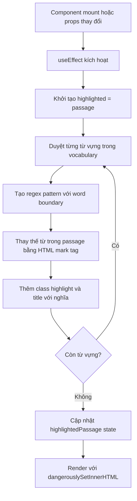
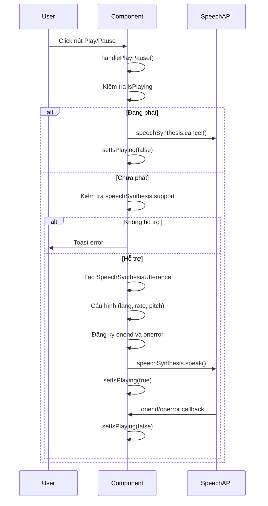
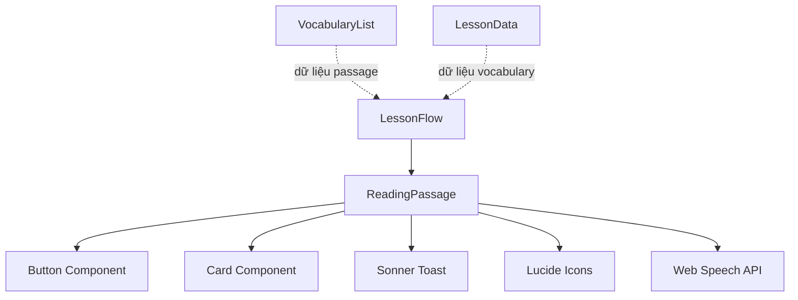
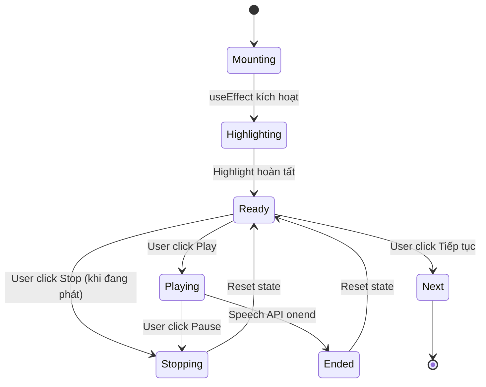
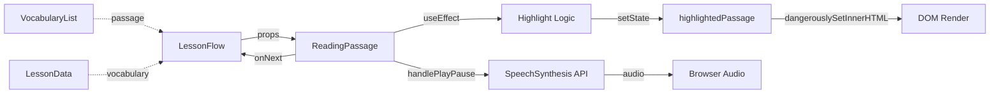
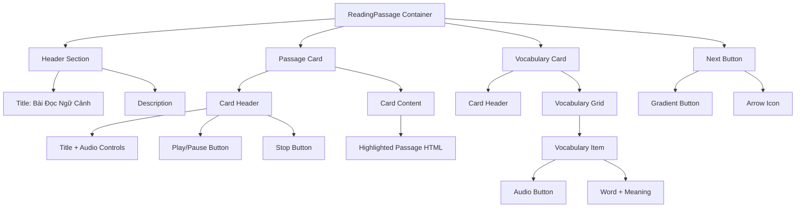

# ReadingPassage Component - Knowledge Documentation

## Tổng quan

`ReadingPassage` là một React client component dùng để hiển thị đoạn văn đọc hiểu với các từ vựng được highlight. Đây là bước thứ 2 trong quy trình học của WordForge AI, sau phần học từ vựng và trước phần luyện viết. Component này cung cấp chức năng đọc hiểu ngữ cảnh, highlight từ vựng đã học, hiển thị nghĩa khi hover, và hỗ trợ phát âm bằng Web Speech API.

### Công nghệ sử dụng
- **Ngôn ngữ**: TypeScript
- **Framework**: Next.js 15 (App Router) - Client Component
- **Thư viện UI**: Radix UI + Tailwind CSS
- **Quản lý trạng thái**: React Hooks (useState, useEffect)
- **Thông báo**: Sonner (toast notifications)
- **Icon**: Lucide React
- **Text-to-Speech**: Web Speech API (SpeechSynthesis)

### Chức năng chính
1. **Hiển thị đoạn văn ngữ cảnh**: Hiển thị đoạn văn được tạo từ bước trước (VocabularyList)
2. **Highlight từ vựng**: Tự động highlight các từ vựng đã học trong đoạn văn với màu vàng
3. **Hiển thị nghĩa từ vựng**: Hiển thị nghĩa tiếng Việt khi hover vào từ được highlight
4. **Phát âm đoạn văn**: Sử dụng Web Speech API để phát âm toàn bộ đoạn văn
5. **Danh sách từ vựng**: Hiển thị grid các từ vựng với nút phát âm từng từ
6. **Điều hướng**: Nút tiếp tục để chuyển sang bước luyện viết

---

## Chi tiết triển khai

### Chữ ký component

```typescript
interface VocabularyItem {
  word: string                    // Từ vựng
  type: string                    // Loại từ (noun, verb, etc.)
  vietnamese_meaning: string       // Nghĩa tiếng Việt
}

interface ReadingPassageProps {
  passage: string                  // Đoạn văn ngữ cảnh
  vocabulary: VocabularyItem[]      // Danh sách từ vựng
  topic: string                    // Chủ đề bài học
  language: string                 // Ngôn ngữ đích
  proficiency: string              // Trình độ ngôn ngữ (A1, A2, B1, v.v.)
  onNext: () => void              // Callback khi hoàn thành
}
```

### Quản lý trạng thái

Component sử dụng hai React state:

```typescript
const [isPlaying, setIsPlaying] = useState(false)              // Trạng thái phát âm đoạn văn
const [highlightedPassage, setHighlightedPassage] = useState("") // Đoạn văn đã được highlight
```

### Quy trình logic chính

#### 1. Quy trình highlight từ vựng



#### 2. Quy trình phát âm đoạn văn



#### 3. Logic highlight từ vựng

**Regex Pattern**:
```typescript
const regex = new RegExp(`\\b${item.word}\\b`, 'gi')
```
- `\\b`: Word boundary - đảm bảo khớp toàn bộ từ, không phải substring
- `'gi'`: Global (tất cả matches) và case-insensitive (không phân biệt hoa thường)

**HTML Replacement**:
```typescript
highlighted = highlighted.replace(regex, 
  `<mark class="bg-yellow-200 px-1 rounded font-semibold" title="${item.vietnamese_meaning}">${item.word}</mark>`
)
```
- Sử dụng `<mark>` tag với class Tailwind để highlight
- `title` attribute hiển thị nghĩa khi hover
- Giữ nguyên từ gốc trong nội dung

### Các hàm quan trọng

#### useEffect (highlight từ vựng)
- **Mục đích**: Tự động highlight từ vựng khi passage hoặc vocabulary thay đổi
- **Logic**:
  1. Duyệt từng từ vựng trong mảng
  2. Tạo regex pattern với word boundary
  3. Thay thế tất cả occurrences bằng HTML mark tag
  4. Cập nhật state `highlightedPassage`
- **Phụ thuộc**: `[passage, vocabulary]`

#### handlePlayPause()
- **Mục đích**: Điều khiển phát/dừng phát âm đoạn văn
- **Logic**:
  1. Kiểm tra trạng thái `isPlaying`
  2. Nếu đang phát: cancel và dừng
  3. Nếu chưa phát: tạo utterance và phát
  4. Xử lý lỗi nếu trình duyệt không hỗ trợ
- **Cấu hình SpeechSynthesis**:
  - `lang`: 'en-US' (hardcode, có thể cải thiện)
  - `rate`: 0.7 (tốc độ chậm hơn bình thường)
  - `pitch`: 1 (giọng bình thường)

#### handleStop()
- **Mục đích**: Dừng phát âm ngay lập tức
- **Logic**: Gọi `speechSynthesis.cancel()` và reset state

#### handleNext()
- **Mục đích**: Chuyển sang bước tiếp theo
- **Logic**: Gọi callback `onNext()` từ component cha

---

## Dependencies

### Phụ thuộc trực tiếp

#### Gói bên ngoài
1. **react** - Thư viện React cốt lõi
2. **lucide-react** - Thư viện icon (ArrowRight, Volume2, Play, Pause, RotateCcw, BookOpen)
3. **sonner** - Thư viện thông báo Toast

#### Component nội bộ
1. `@/components/ui/button` - Component nút (dựa trên Radix UI)
2. `@/components/ui/card` - Component card (Card, CardContent, CardHeader, CardTitle, CardDescription)

### Phụ thuộc trình duyệt

#### Web Speech API
- **speechSynthesis**: API phát âm văn bản
- **SpeechSynthesisUtterance**: Object chứa cấu hình phát âm
- **Tương thích**: Kiểm tra `'speechSynthesis' in window` trước khi sử dụng
- **Hỗ trợ trình duyệt**: Chrome, Edge, Safari (một phần), Firefox (không hỗ trợ)

### Phụ thuộc component cha

#### LessonFlow.tsx
- ReadingPassage là component bước 2 trong LessonFlow
- Nhận dữ liệu `passage` từ bước trước (VocabularyList)
- Nhận `vocabulary` từ `lessonData`
- Thông qua callback `onNext()` thông báo LessonFlow chuyển sang bước 3 (WritingPractice)

### Sơ đồ phân cấp phụ thuộc



---

## Visual Diagrams

### Vòng đời component



### Luồng dữ liệu



### Cấu trúc bố cục UI



---

## Key Patterns & Design Decisions

### 1. Sử dụng dangerouslySetInnerHTML
- **Quyết định**: Sử dụng `dangerouslySetInnerHTML` để render HTML đã được highlight
- **Lý do**: Cần render HTML động với mark tags, không thể dùng JSX thuần
- **Rủi ro**: XSS nếu passage chứa nội dung không tin cậy
- **Giảm thiểu**: Passage đến từ AI hoặc nguồn tin cậy, không phải user input trực tiếp
- **Gợi ý cải thiện**: Sử dụng thư viện sanitize HTML hoặc tạo React elements thay vì HTML string

### 2. Highlight với Word Boundary
- **Quyết định**: Sử dụng regex `\b` để đảm bảo khớp toàn bộ từ
- **Lý do**: Tránh highlight substring (ví dụ: "cat" trong "category")
- **Hạn chế**: Có thể không highlight từ có dấu câu liền kề
- **Ví dụ**: "word." có thể không khớp nếu regex không xử lý dấu câu

### 3. Cấu hình SpeechSynthesis cố định
- **Quyết định**: Hardcode `lang: 'en-US'`, `rate: 0.7`, `pitch: 1`
- **Lý do**: Đơn giản hóa implementation
- **Hạn chế**: Không linh hoạt với các ngôn ngữ khác
- **Gợi ý cải thiện**: Sử dụng prop `language` để cấu hình động

### 4. Quản lý trạng thái phát âm
- **Quyết định**: Sử dụng state `isPlaying` để theo dõi trạng thái
- **Lý do**: Cần cập nhật UI (icon Play/Pause) theo trạng thái
- **Vấn đề**: State có thể không đồng bộ với SpeechSynthesis thực tế
- **Giải pháp**: Sử dụng `onend` và `onerror` callbacks để đồng bộ

### 5. Hiển thị nghĩa với title attribute
- **Quyết định**: Sử dụng HTML `title` attribute để hiển thị nghĩa khi hover
- **Lý do**: Đơn giản, không cần thêm component hoặc state
- **Hạn chế**: Tooltip mặc định của trình duyệt, không tùy chỉnh được
- **Gợi ý cải thiện**: Sử dụng Radix UI Tooltip để có tooltip đẹp hơn

### 6. Grid layout từ vựng responsive
- **Quyết định**: Sử dụng Tailwind grid với breakpoints
- **Logic**: `grid-cols-2 md:grid-cols-3 lg:grid-cols-4`
- **Lý do**: Responsive tốt trên mọi kích thước màn hình
- **Tối ưu**: Sử dụng `truncate` để tránh overflow text

---

## Error Handling

### Xử lý lỗi SpeechSynthesis

```typescript
// Kiểm tra hỗ trợ trình duyệt
if ('speechSynthesis' in window) {
  // Sử dụng API
} else {
  toast.error("Trình duyệt không hỗ trợ Text-to-Speech")
}

// Xử lý lỗi phát âm
utterance.onerror = () => setIsPlaying(false)
utterance.onend = () => setIsPlaying(false)
```

### UI trạng thái lỗi
- **Không hỗ trợ SpeechSynthesis**: Disable nút Play/Pause, hiển thị toast error
- **Lỗi phát âm**: Tự động reset state `isPlaying` về false

### Các trường hợp biên
1. **Passage trống**: Component vẫn render nhưng không có nội dung
2. **Vocabulary trống**: Không có từ nào được highlight
3. **Từ vựng không xuất hiện trong passage**: Regex không khớp, từ không được highlight
4. **SpeechSynthesis bị cancel bởi trình duyệt**: State có thể không đồng bộ

---

## Performance Considerations

### Điểm tối ưu

1. **useEffect với dependencies**: Chỉ highlight lại khi `passage` hoặc `vocabulary` thay đổi
2. **Regex hiệu quả**: Sử dụng word boundary để tối ưu matching
3. **Render có điều kiện**: Không render không cần thiết

### Vấn đề tiềm ẩn

1. **Highlight với nhiều từ vựng**: 
   - **Hiện tại**: Duyệt tuần tự và replace từng từ
   - **Rủi ro**: Với passage dài và nhiều từ vựng, có thể chậm
   - **Gợi ý**: Sử dụng một lần replace với regex tổng hợp hoặc memoize kết quả

2. **dangerouslySetInnerHTML**: 
   - **Rủi ro**: Re-render mỗi lần state thay đổi
   - **Gợi ý**: Sử dụng React elements thay vì HTML string để tận dụng React reconciliation

3. **SpeechSynthesis không cleanup**:
   - **Hiện tại**: Không cleanup khi component unmount
   - **Rủi ro**: Speech có thể tiếp tục phát sau khi component unmount
   - **Gợi ý**: Thêm cleanup trong useEffect return

---

## Security Considerations

### XSS Protection

- **Rủi ro**: `dangerouslySetInnerHTML` có thể render HTML độc hại
- **Hiện tại**: Passage đến từ AI (Gemini API), tương đối an toàn
- **Giảm thiểu**: 
  - Không cho phép user input trực tiếp vào passage
  - AI-generated content được validate ở API layer
- **Gợi ý cải thiện**: 
  - Sanitize HTML trước khi render
  - Sử dụng thư viện như DOMPurify
  - Hoặc tạo React elements thay vì HTML string

### Data Privacy

- **Hiện tại**: Tất cả dữ liệu được xử lý phía client
- **Passage và vocabulary**: Không gửi đến bên thứ ba
- **SpeechSynthesis**: Chạy local trên trình duyệt, không gửi dữ liệu

---

## Testing Considerations

### Các tình huống cần kiểm thử

1. **Render ban đầu**
   - Render với passage và vocabulary hợp lệ
   - Render với passage trống
   - Render với vocabulary trống
   - Render với passage không chứa từ vựng nào

2. **Highlight từ vựng**
   - Highlight đúng các từ trong passage
   - Không highlight substring (word boundary)
   - Highlight nhiều occurrences của cùng một từ
   - Xử lý case-insensitive matching
   - Xử lý từ có dấu câu liền kề

3. **Phát âm**
   - Phát âm đoạn văn thành công
   - Dừng phát âm
   - Xử lý trình duyệt không hỗ trợ
   - Xử lý lỗi phát âm
   - Phát âm từng từ trong vocabulary list

4. **Tương tác người dùng**
   - Click nút Play/Pause
   - Click nút Stop
   - Hover vào từ được highlight (xem nghĩa)
   - Click nút phát âm từng từ
   - Click nút Tiếp tục

5. **Trường hợp biên**
   - Passage rất dài
   - Nhiều từ vựng (100+)
   - Từ vựng có ký tự đặc biệt
   - Passage có HTML tags

### Công cụ kiểm thử đề xuất
- **Kiểm thử đơn vị**: React Testing Library + Jest
- **Mock SpeechSynthesis**: Cần mock `window.speechSynthesis` và `SpeechSynthesisUtterance`
- **Kiểm thử tích hợp**: Kiểm thử với LessonFlow
- **Kiểm thử E2E**: Playwright/Cypress kiểm thử quy trình hoàn chỉnh

---

## Known Issues & Improvements

### Vấn đề hiện tại

1. **Hardcode ngôn ngữ SpeechSynthesis**: `lang: 'en-US'` không sử dụng prop `language`
2. **Không cleanup SpeechSynthesis**: Có thể phát tiếp sau khi unmount
3. **XSS risk với dangerouslySetInnerHTML**: Cần sanitize hoặc refactor
4. **Tooltip mặc định**: `title` attribute không đẹp, nên dùng Radix Tooltip

### Gợi ý cải thiện

1. **Tối ưu hiệu suất**
   - Memoize highlighted passage
   - Sử dụng React elements thay vì HTML string
   - Cleanup SpeechSynthesis khi unmount

2. **Trải nghiệm người dùng**
   - Thêm Radix UI Tooltip cho nghĩa từ vựng
   - Thêm progress indicator khi phát âm
   - Thêm tùy chọn điều chỉnh tốc độ phát âm
   - Highlight từ đang được phát âm

3. **Tăng cường chức năng**
   - Hỗ trợ nhiều ngôn ngữ cho SpeechSynthesis
   - Thêm chức năng highlight từ khi click
   - Thêm chức năng copy passage
   - Thêm chức năng in passage

4. **Chất lượng mã**
   - Refactor dangerouslySetInnerHTML thành React elements
   - Thêm TypeScript types nghiêm ngặt hơn
   - Thêm JSDoc comments
   - Extract constants (speech config)

5. **Khả năng truy cập**
   - Thêm ARIA labels cho các nút
   - Cải thiện keyboard navigation
   - Thêm screen reader support
   - Cải thiện focus management

---

## Related Components & Files

### Liên quan trực tiếp
- `src/components/LessonFlow.tsx` - Component cha, quản lý quy trình học
- `src/components/VocabularyList.tsx` - Component bước trước, tạo passage

### Component liên quan
- `src/components/WritingPractice.tsx` - Component bước tiếp theo
- `src/components/ExerciseSection.tsx` - Component sử dụng passage tương tự
- `src/components/ListeningSpeaking.tsx` - Component cũng sử dụng SpeechSynthesis

### Thư viện UI component
- `src/components/ui/button.tsx`
- `src/components/ui/card.tsx`

---

## Metadata

- **Đường dẫn file**: `src/components/ReadingPassage.tsx`
- **Ngày phân tích**: 2024-12-19
- **Số dòng mã**: 168 dòng
- **Loại component**: Client Component ("use client")
- **Độ phức tạp**: Trung bình (highlight logic, SpeechSynthesis integration)
- **Độ sâu phụ thuộc**: 1 tầng (phụ thuộc trực tiếp UI component và Browser API)
- **Cập nhật lần cuối**: Dựa trên trạng thái codebase hiện tại

---

## Next Steps

### Cải thiện ngắn hạn
1. Thêm cleanup SpeechSynthesis khi component unmount
2. Sử dụng prop `language` cho SpeechSynthesis thay vì hardcode
3. Thêm sanitize HTML hoặc refactor dangerouslySetInnerHTML
4. Thêm ARIA labels và cải thiện accessibility

### Cải thiện trung hạn
1. Thêm Radix UI Tooltip cho nghĩa từ vựng
2. Memoize highlighted passage để tối ưu performance
3. Thêm progress indicator khi phát âm
4. Cải thiện error handling và user feedback

### Cải thiện dài hạn
1. Refactor sang React elements thay vì HTML string
2. Thêm chức năng highlight từ khi click
3. Hỗ trợ nhiều ngôn ngữ SpeechSynthesis
4. Thêm chức năng copy và in passage

---

## Summary

`ReadingPassage` là một component đọc hiểu quan trọng trong quy trình học, cung cấp chức năng hiển thị đoạn văn với từ vựng được highlight và hỗ trợ phát âm. Component được thiết kế đơn giản nhưng hiệu quả, với một số điểm cần cải thiện về security (dangerouslySetInnerHTML), performance (highlight logic), và user experience (tooltip, cleanup).

Điểm chính:
- ✅ Highlight từ vựng tự động với word boundary
- ✅ Hỗ trợ phát âm đoạn văn và từng từ
- ✅ Hiển thị nghĩa khi hover
- ✅ Responsive layout
- ⚠️ Cần cải thiện security (sanitize HTML)
- ⚠️ Cần cleanup SpeechSynthesis
- ⚠️ Cần sử dụng prop language thay vì hardcode

---

**Lưu ý**: Tài liệu này được tạo dựa trên trạng thái codebase hiện tại. Trong quá trình phát triển thực tế, mã có thể đã thay đổi, vui lòng tham khảo mã mới nhất để xác minh.

