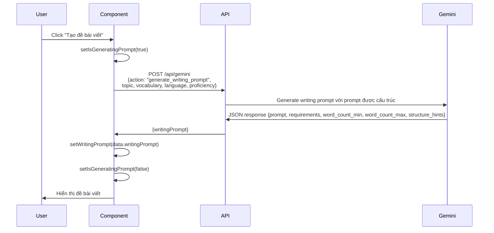
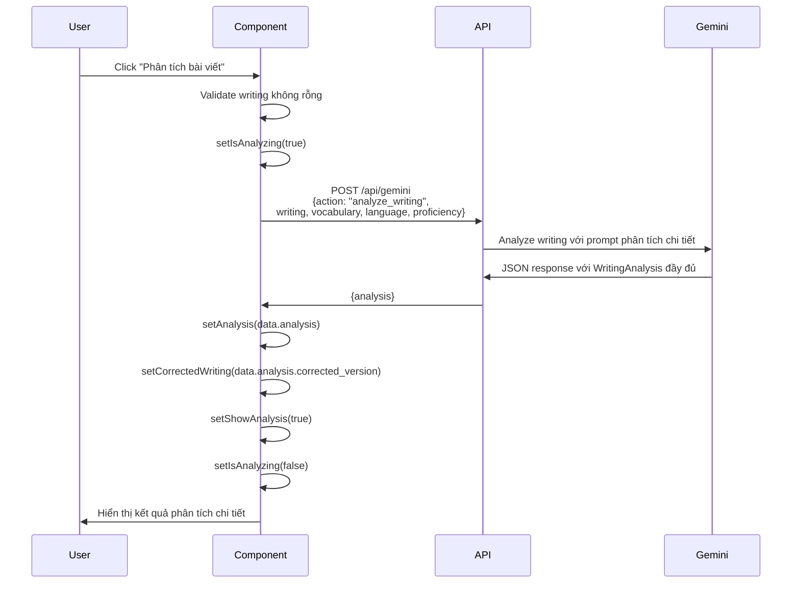
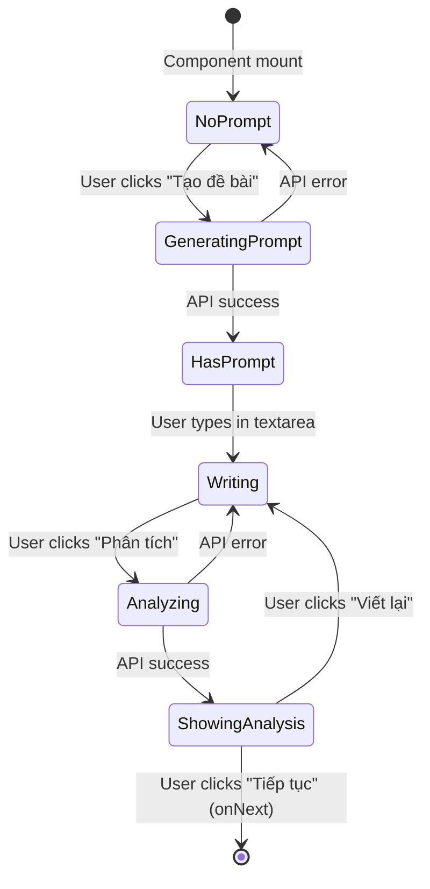
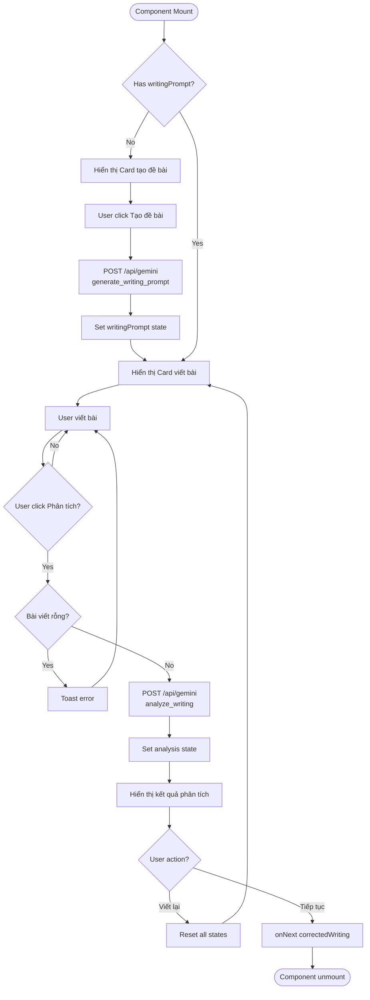
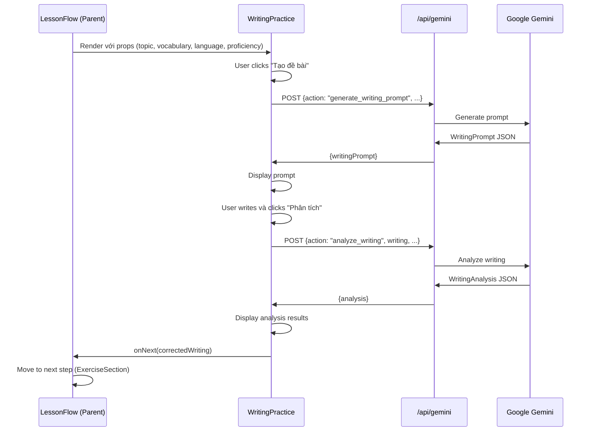
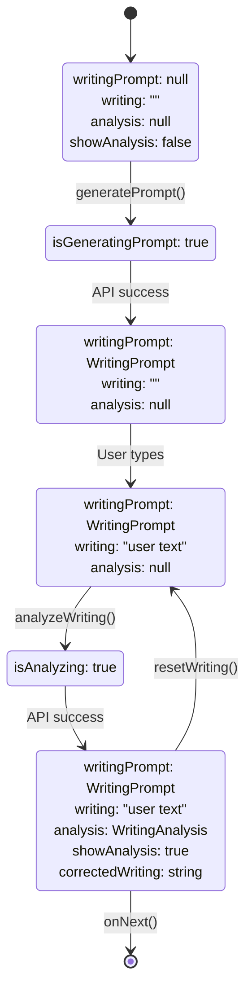

# WritingPractice Component - Knowledge Documentation

## Tổng quan

`WritingPractice` là một React client component dùng để luyện tập kỹ năng viết với AI hỗ trợ. Đây là bước thứ 3 trong quy trình học của WordForge AI, sau phần đọc hiểu (ReadingPassage) và trước phần luyện tập (ExerciseSection). Component này cung cấp chức năng tạo đề bài viết bằng AI, cho phép người học viết bài, và phân tích chi tiết bài viết với phản hồi đa chiều về từ vựng, ngữ pháp, cấu trúc và nội dung.

### Công nghệ sử dụng
- **Ngôn ngữ**: TypeScript
- **Framework**: Next.js 15 (App Router) - Client Component
- **Thư viện UI**: Radix UI + Tailwind CSS
- **Quản lý trạng thái**: React Hooks (useState)
- **Thông báo**: Sonner (toast notifications)
- **Icon**: Lucide React
- **AI Integration**: Google Generative AI (Gemini) qua API route `/api/gemini`

### Chức năng chính
1. **Tạo đề bài viết**: Sử dụng AI để tạo đề bài viết phù hợp với trình độ và chủ đề
2. **Viết bài**: Cung cấp textarea để người học viết bài với đếm số từ
3. **Phân tích bài viết**: AI phân tích bài viết theo nhiều tiêu chí (từ vựng, ngữ pháp, cấu trúc, nội dung)
4. **Hiển thị kết quả**: Hiển thị điểm số chi tiết, lỗi ngữ pháp, gợi ý cải thiện
5. **Phiên bản đã sửa**: Cung cấp phiên bản bài viết đã được AI sửa lỗi
6. **Điều hướng**: Chuyển sang bước tiếp theo với bài viết đã sửa

---

## Chi tiết triển khai

### Chữ ký component

```typescript
interface VocabularyItem {
  word: string                    // Từ vựng
  type: string                    // Loại từ (noun, verb, etc.)
  vietnamese_meaning: string       // Nghĩa tiếng Việt
  english_definition?: string      // Định nghĩa tiếng Anh (tùy chọn)
}

interface WritingPrompt {
  prompt: string                  // Đề bài viết
  requirements: string            // Yêu cầu cụ thể
  word_count_min: number          // Số từ tối thiểu
  word_count_max: number          // Số từ tối đa
  structure_hints: string         // Gợi ý cấu trúc
}

interface WritingAnalysis {
  vocabulary_usage: {
    used_words: string[]           // Từ đã sử dụng
    unused_words: string[]         // Từ chưa sử dụng
    usage_count: number           // Số từ đã dùng
    total_words: number            // Tổng số từ cần dùng
    score: number                  // Điểm (1-10)
  }
  grammar_analysis: {
    errors: Array<{
      sentence: string             // Câu có lỗi
      error: string                // Mô tả lỗi
      correction: string           // Câu đã sửa
      explanation: string          // Giải thích
    }>
    score: number                  // Điểm (1-10)
  }
  vocabulary_improvements: Array<{
    original: string               // Từ gốc
    suggestion: string              // Từ đề xuất
    reason: string                  // Lý do
  }>
  structure_feedback: {
    strengths: string[]             // Điểm mạnh
    improvements: string[]          // Điểm cần cải thiện
    score: number                   // Điểm (1-10)
  }
  content_feedback: {
    coherence: string               // Đánh giá tính mạch lạc
    completeness: string            // Đánh giá tính đầy đủ
    score: number                   // Điểm (1-10)
  }
  overall_score: number             // Điểm tổng thể (1-10)
  corrected_version: string         // Phiên bản đã sửa
  encouragement: string             // Lời khích lệ
}

interface WritingPracticeProps {
  topic: string                    // Chủ đề bài học
  vocabulary: VocabularyItem[]      // Danh sách từ vựng
  language: string                 // Ngôn ngữ đích
  proficiency: string              // Trình độ ngôn ngữ (A1, A2, B1, v.v.)
  onNext: (correctedWriting: string) => void  // Callback với bài viết đã sửa
}
```

### Quản lý trạng thái

Component sử dụng 7 React state để quản lý luồng làm việc:

```typescript
const [writingPrompt, setWritingPrompt] = useState<WritingPrompt | null>(null)
const [isGeneratingPrompt, setIsGeneratingPrompt] = useState(false)
const [writing, setWriting] = useState("")
const [isAnalyzing, setIsAnalyzing] = useState(false)
const [analysis, setAnalysis] = useState<WritingAnalysis | null>(null)
const [showAnalysis, setShowAnalysis] = useState(false)
const [correctedWriting, setCorrectedWriting] = useState("")
```

### Quy trình logic chính

#### 1. Quy trình tạo đề bài viết



#### 2. Quy trình phân tích bài viết



#### 3. Luồng trạng thái UI



### Các hàm chính

#### `generatePrompt()`
Tạo đề bài viết bằng cách gọi API Gemini với action `generate_writing_prompt`.

**Xử lý lỗi:**
- Hiển thị toast error nếu API trả về lỗi
- Log error vào console để debug
- Luôn reset `isGeneratingPrompt` trong finally block

#### `analyzeWriting()`
Phân tích bài viết bằng cách gọi API Gemini với action `analyze_writing`.

**Validation:**
- Kiểm tra `writing.trim()` không rỗng trước khi gọi API
- Hiển thị toast error nếu bài viết rỗng

**Xử lý kết quả:**
- Lưu analysis vào state
- Lưu corrected_version để truyền cho bước tiếp theo
- Hiển thị toast success khi hoàn thành

#### `resetWriting()`
Reset tất cả state về trạng thái ban đầu để cho phép viết lại.

#### `getScoreColor(score: number)` và `getScoreBgColor(score: number)`
Helper functions để xác định màu hiển thị điểm số:
- `>= 8`: Xanh lá (green)
- `>= 6`: Vàng (yellow)
- `< 6`: Đỏ (red)

#### Đếm số từ
```typescript
const wordCount = writing.trim().split(/\s+/).filter(word => word.length > 0).length
```
Đếm số từ bằng cách split theo whitespace và filter các từ không rỗng.

### Cấu trúc UI

Component được chia thành 3 phần chính:

1. **Card tạo đề bài** (khi chưa có `writingPrompt`):
   - Nút "Tạo đề bài viết" với loading state
   - Hiển thị icon và animation khi đang tạo

2. **Card viết bài** (khi có `writingPrompt` và chưa `showAnalysis`):
   - Hiển thị đề bài với requirements, structure hints, word count range
   - Textarea để viết bài
   - Đếm số từ real-time
   - Nút "Làm lại" và "Phân tích bài viết"

3. **Kết quả phân tích** (khi `showAnalysis === true`):
   - Card tổng quan với overall score và encouragement
   - Grid 4 cards chi tiết:
     - Sử dụng từ vựng (vocabulary usage)
     - Ngữ pháp (grammar analysis)
     - Cấu trúc bài viết (structure feedback)
     - Nội dung (content feedback)
   - Card phiên bản đã sửa
   - Nút "Viết lại" và "Tiếp tục"

### Styling và UX

- **Gradient buttons**: Sử dụng gradient từ blue-purple cho các nút chính
- **Color-coded scores**: Điểm số được hiển thị với màu tương ứng (xanh/vàng/đỏ)
- **Badge system**: Từ vựng được hiển thị dưới dạng badge với màu xanh (đã dùng) và đỏ (chưa dùng)
- **Error display**: Lỗi ngữ pháp được hiển thị với border-left màu đỏ và cấu trúc rõ ràng
- **Responsive grid**: Grid 2 cột trên desktop, 1 cột trên mobile

---

## Dependencies

### Internal Dependencies

#### Components
- `@/components/ui/button` - Button component từ Radix UI
- `@/components/ui/card` - Card components (Card, CardContent, CardDescription, CardHeader, CardTitle)
- `@/components/ui/textarea` - Textarea component
- `@/components/ui/label` - Label component

#### API Routes
- `/api/gemini` - API route xử lý các request đến Google Gemini AI
  - Action: `generate_writing_prompt` - Tạo đề bài viết
  - Action: `analyze_writing` - Phân tích bài viết

#### Parent Component
- `LessonFlow` - Component cha quản lý luồng bài học
  - Truyền props: `topic`, `vocabulary`, `language`, `proficiency`
  - Nhận callback: `onNext(correctedWriting)` để chuyển sang bước tiếp theo

### External Dependencies

#### NPM Packages
- `react` - React framework
- `lucide-react` - Icon library (ArrowRight, CheckCircle, XCircle, RotateCcw, PenTool, BookOpen, Star, AlertCircle)
- `sonner` - Toast notification library

#### Browser APIs
- Không sử dụng browser APIs trực tiếp (tất cả thông qua React và Next.js)

### Dependency Graph

```mermaid
graph TD
    A[WritingPractice] --> B[UI Components]
    A --> C[/api/gemini]
    A --> D[LessonFlow]
    
    B --> B1[Button]
    B --> B2[Card]
    B --> B3[Textarea]
    B --> B4[Label]
    
    C --> C1[Google Gemini AI]
    
    D --> D1[Dashboard]
    
    A --> E[React Hooks]
    A --> F[Sonner]
    A --> G[Lucide Icons]
    
    style A fill:#e1f5ff
    style C fill:#fff4e1
    style C1 fill:#ffe1e1
```

---

## Visual Diagrams

### Component Flow Diagram



### Data Flow Diagram



### State Management Diagram



---

## Additional Insights

### Điểm mạnh của implementation

1. **Tách biệt concerns rõ ràng**: Mỗi function có trách nhiệm cụ thể (generate, analyze, reset)
2. **Error handling tốt**: Có validation và error handling ở mọi bước
3. **UX tốt**: Loading states, toast notifications, color-coded feedback
4. **Type safety**: Sử dụng TypeScript interfaces đầy đủ cho tất cả data structures
5. **Reusable helpers**: Functions như `getScoreColor` có thể tái sử dụng

### Các điểm cần cải thiện

1. **Validation từ vựng**: Hiện tại chỉ kiểm tra bài viết không rỗng, có thể thêm validation số từ tối thiểu
2. **Auto-save**: Có thể thêm auto-save bài viết vào localStorage để tránh mất dữ liệu
3. **Undo/Redo**: Có thể thêm chức năng undo/redo cho textarea
4. **Export bài viết**: Cho phép export bài viết và kết quả phân tích ra file
5. **Lịch sử**: Lưu lịch sử các bài viết đã viết để xem lại
6. **So sánh**: Cho phép so sánh nhiều phiên bản bài viết
7. **Performance**: Có thể optimize re-render bằng React.memo nếu component lớn hơn

### Security Considerations

1. **Input sanitization**: Bài viết của user được gửi trực tiếp đến API, cần đảm bảo API route sanitize input
2. **XSS protection**: Khi hiển thị `correctedWriting`, đảm bảo không có XSS (hiện tại chỉ hiển thị text, không dùng dangerouslySetInnerHTML)
3. **Rate limiting**: API route nên có rate limiting để tránh abuse

### Performance Considerations

1. **API calls**: Mỗi lần generate prompt hoặc analyze đều gọi API, có thể cache prompt nếu user muốn viết lại
2. **Re-renders**: Component có nhiều state, cần đảm bảo không có unnecessary re-renders
3. **Bundle size**: Import toàn bộ lucide-react icons có thể tăng bundle size, nên tree-shake được

### Accessibility

1. **Keyboard navigation**: Tất cả buttons đều keyboard accessible
2. **Screen readers**: Cần thêm ARIA labels cho các phần tử quan trọng
3. **Color contrast**: Đảm bảo màu sắc đạt WCAG AA standards
4. **Focus management**: Khi chuyển giữa các state, cần quản lý focus hợp lý

### Testing Considerations

1. **Unit tests**: Test các helper functions (`getScoreColor`, `getScoreBgColor`, word count logic)
2. **Integration tests**: Test flow từ generate prompt → write → analyze → next
3. **API mocking**: Mock API responses để test các trường hợp success/error
4. **User interaction**: Test các interactions như typing, clicking buttons, reset

---

## Metadata

### File Information
- **Path**: `src/components/WritingPractice.tsx`
- **Lines of Code**: 494
- **Component Type**: Client Component ("use client")
- **Language**: TypeScript
- **Framework**: Next.js 15 (App Router)

### Analysis Date
- **Date**: 2024-12-19
- **Analysis Depth**: Level 3 (Component + Dependencies + API Integration)

### Related Files
- `src/components/LessonFlow.tsx` - Parent component
- `src/app/api/gemini/route.ts` - API route xử lý AI requests
- `src/components/ui/*` - UI component dependencies
- `docs/ai/implementation/knowledge-reading-passage.md` - Similar component documentation

### Key Dependencies Count
- **Internal Components**: 4 (Button, Card, Textarea, Label)
- **API Routes**: 1 (/api/gemini)
- **External Packages**: 3 (react, lucide-react, sonner)
- **State Variables**: 7
- **Main Functions**: 4 (generatePrompt, analyzeWriting, resetWriting, helpers)

### Complexity Metrics
- **Cyclomatic Complexity**: Medium (nhiều conditional branches)
- **State Complexity**: Medium-High (7 state variables với nhiều interactions)
- **API Integration**: High (2 API calls với error handling)
- **UI Complexity**: High (3 major UI states với nhiều sub-components)

---

## Next Steps

### Immediate Actions
1. ✅ Đã tạo tài liệu kiến thức cho WritingPractice component
2. 🔄 Review tài liệu với team để đảm bảo accuracy
3. 📝 Commit tài liệu vào repository

### Suggested Follow-ups

#### Related Components to Document
1. **ExerciseSection** - Component tiếp theo trong flow, cũng sử dụng AI để tạo exercises
2. **ListeningSpeaking** - Component cuối cùng trong flow
3. **VocabularyList** - Component đầu tiên trong flow

#### Potential Improvements
1. **Thêm unit tests** cho WritingPractice component
2. **Thêm integration tests** cho flow generate → write → analyze
3. **Optimize performance** nếu component trở nên chậm
4. **Thêm accessibility features** như ARIA labels
5. **Thêm error boundaries** để handle errors gracefully

#### Documentation Updates
1. Cập nhật design docs nếu có thay đổi về UI/UX
2. Cập nhật testing docs với test cases cho WritingPractice
3. Cập nhật deployment docs nếu có thay đổi về API requirements

### Questions for Clarification
1. Có cần thêm validation cho số từ tối thiểu trước khi phân tích không?
2. Có cần lưu draft bài viết vào database không?
3. Có cần thêm chức năng so sánh nhiều phiên bản bài viết không?
4. Có cần thêm export functionality không?

---

## Tóm tắt

`WritingPractice` là một component quan trọng trong luồng học của WordForge AI, cung cấp trải nghiệm luyện viết với AI hỗ trợ. Component này tích hợp chặt chẽ với Google Gemini AI để tạo đề bài và phân tích bài viết một cách chi tiết. Với 7 state variables và 2 API integrations, component có độ phức tạp trung bình-cao nhưng được tổ chức tốt với error handling và UX considerations.

Component này là bước thứ 3 trong 5 bước của lesson flow, nhận input từ ReadingPassage và truyền output (correctedWriting) cho ExerciseSection. Việc hiểu rõ component này sẽ giúp maintain và extend functionality trong tương lai.

